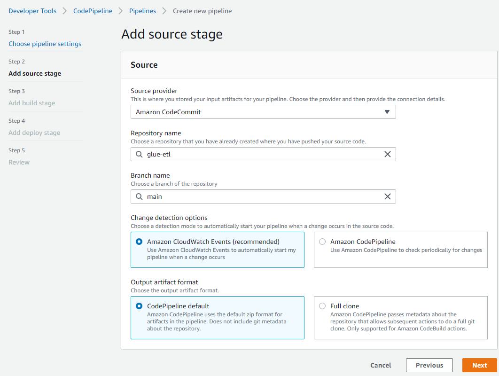

# AWS CodePipeline for Amazon Glue Deployment

This solution is modified from an existing AWS Pattern (
https://docs.aws.amazon.com/prescriptive-guidance/latest/patterns/deploy-an-aws-glue-job-with-an-aws-codepipeline-ci-cd-pipeline.html ). It adds the logic for updating Glue job and approval step in Codepipeline. These changes make it closer to real case.

The following description is copied from above link:

>This pattern demonstrates how you can integrate Amazon Web Services (AWS) CodeCommit and AWS CodePipeline with AWS Glue, and use AWS Lambda to launch jobs as soon as a developer pushes their changes to a remote AWS CodeCommit repository. 
>
>When a developer submits a change to an extract, transform, and load (ETL) repository and pushes the changes to AWS CodeCommit, a new pipeline is invoked. The pipeline initiates a Lambda function that launches an AWS Glue job with these changes. The AWS Glue job performs the ETL task.
>
>This solution is helpful in the situation where businesses, developers, and data engineers want to launch jobs as soon as changes are committed and pushed to the target repositories. It helps achieve a higher level of automation and reproducibility, therefore avoiding errors during the job launch and lifecycle.

## Architecture

## Deployment Guide

### prerequisites
* AWS Account with Admin Right
* git
* Python3 Envionment

### Create AWS Roles for Lambda and Glue

#### Create AWS Role for Lambda
To simplify deployment, we can add the following permissions to Lambda execution role:
1. AWSCodePipeline_FullAccess 
2. AmazonS3FullAccess
3. AWSGlueConsoleFullAccess
4. AWSCodeCommitReadOnly
5. CloudWatchLogsFullAccess
6. Trust relationships for lambda.amazonaws.com

Note: For production environment, please only allocate the least permissions. 

For exmaple, the role name is: CodePipeline_For_Glue_Lambda_Role.

   
   

#### Create AWS Role for Glue job
To simplify deployment, we can add the following permissions to Glue job execution role:
1. AWSGlueServiceRole
2. Trust relationships for glue.amazonaws.com

For exmaple, the role name is: CodePipeline_For_Glue_Execution_Role
    
    

### Create CodeCommit Respository
For example, the repository name is glue-etl. Use 'Connection steps' guide to set up git credentials.

### Create SNS topic
Create a SNS topic to recieve Approval request. Subscribe your email to this topic.

### Deploy Lambda Function

### Deploy Lambda Function - lambda_pipepline_update_glue
Create a Lambda Function with the following:
- Name: lambda_pipepline_update_glue
- Role: CodePipeline_For_Glue_Lambda_Role
- Code: Copy the content from lambda_pipepline_update_glue.py to lambda_function.py
- Timeout: 5 min
- Environment variables:
    - GLUE_BUCKET: \<The bucket for Glue scripts>
    - GLUE_PREFIX: \<The prefix (no leading / or ending /)>
    - REPOSITORY_NAME: \<The CodeCommit Repository>
    

### Deploy Lambda Function - lambda_pipepline_update_run
Create a Lambda Function with the following:
- Name: lambda_pipepline_run_glue
- Role: CodePipeline_For_Glue_Lambda_Role
- Code: Copy the content from lambda_pipepline_run_glue.py to lambda_function.py
- Timeout: 5 min

### Create CodePipeline
1. Create a pipeline
   - Name: glue-pipeline
   - Service role: New service role
    
2. Add source stage
   - Source: CodeCommit
   - Reposity: \<The CodeCommit Repository>
   - Branch name: main
   
3. Add build stage
   - Skip build stage
4. Add deploy stage
   - We will remove this stage later.
   - Deploy provider: Amazon S3
   - Bucket: \<Choose any bucket >
   - S3 object key: \<Input any name >
   - 
4. Edit this pipeline
   - Edit Deploy stage
   - Delete existing S3 Deploy
   - Add action group:
     - Action name: Deploy
     - Action provider: Amazon Lambda
     - Input artifacts: SourceArtifact
     - Function name: lambda_pipepline_update_glue
     - Variable namespace: GluePipeline
     - 
   - Add stage after Deploy
     - Stage name: Execute
   - Add action group
     - Action name: Approve
     - Action provider: Manual approval
     - SNS topic ARN: \<SNS topic ARN>
     - Comments: Make sure to review the code before approving this action. Glue Job Name: #{GluePipeline.glue_job_name}
     - 
   - Add action group:
     - Action name: Run
     - Action provider: Amazon Lambda
     - Input artifacts: SourceArtifact
     - Function name: lambda_pipepline_run_glue
     - User parameter: #{GluePipeline.glue_job_name}
     - 
5. The final piplie is like 
   
   

### Test pipeline
1. Clone the empty repository from CodeCommit
   
   `git clone https://<endpoint of codecommit>/v1/repos/glue-etl`

   `cd glue-etl`

   `copy the folder glue-etl-01 in sampel to here`

   `The folder name and script name is identical to Glue job name`

2. Push code to CodeCommit to create a Glue job.  The commit message needs to use format of `create <glue job name> xxx` .

    `git checkout -b main`

    `git stage .`

    `git commit -m "create glue-etl-01 initial job"`

    `git push --set-upstream origin main`

3. The commit triggers the Codepipeline
   
    

4. The pipeline goes to Deploy stage to create Glue job
   
    
    

5. Once Deploy is done, it goes to Execute stage to wait for Approval to continue.
   
    

6. You will get an email for notification of approval request. Click Review
   
    

7. If it is approved, pipeline continues to run the Glue job.
   
    

8. Soon the job is run.
   
    
    

9. Update Glue code, then git commit an update. The commit message needs to use format of `update <glue job name> xxx` .

    `git stage .`

    `git commit -m "update glue-etl-01 add more features"`

    `git push`

10. The pipeline starts to Source, Deploy and Execute stages as above.

## Troubleshooting
The following logs can be examinzed for trouleshooting:
- Lambda logs in CloudWatch logs.
- Glue logs in CloudWatch logs.

## Future Plan
Next plan is to simplify commit message to remove the need of `create/update <glue job name>`. It will retrieve the code change to determine the related glue job.